# Shift Roster Builder

A web application that lets a manager create and manage a weekly staff schedule for a small team.

Built for **Option A: Shift Roster Builder** — Internship Coding Challenge.

## Setup

```bash
npm install
npm run dev
```

Opens at http://localhost:5173. Demo data loads on first launch (or select "Demo" from the team dropdown). All data is stored in-memory; teams are persisted to JSON files under `data/teams/`.

---

## 1. Core Requirements

### 1.1 Add, Edit, and Remove Employees

Each employee has a name and one or more roles (e.g. Cashier, Supervisor, Cook). Roles are comma-separated free-text input.

**Add:**

| Before | During (Form Filled) | After (Card Added) |
|--------|----------------------|---------------------|
| 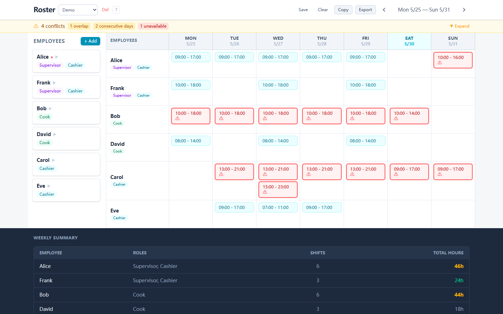 | 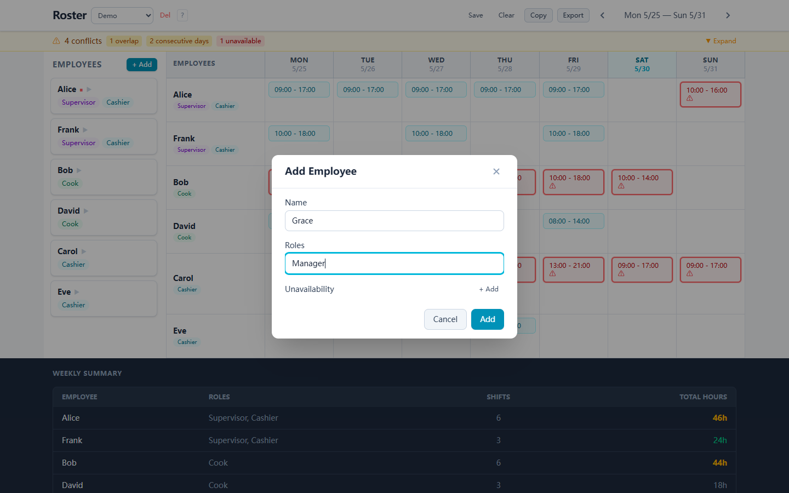 |  |

**Edit:**

| Before | During (Editing Name) | After (Name Updated) |
|--------|----------------------|-----------------------|
| 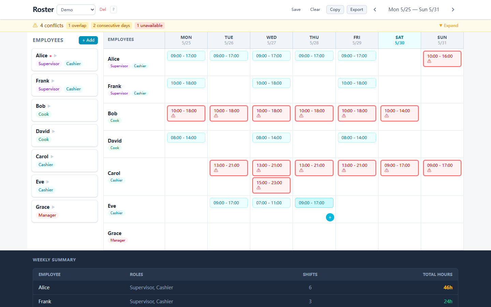 | 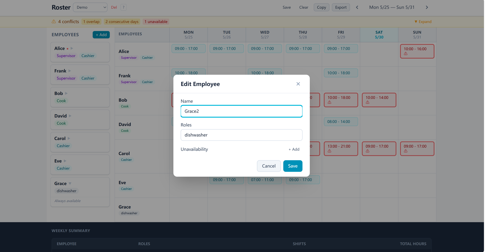 | 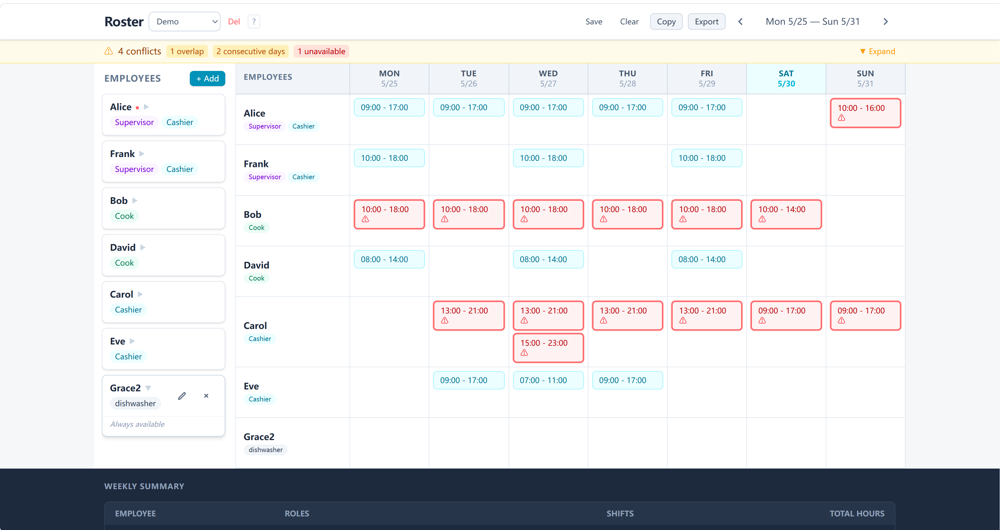 |

**Remove:**

| Before | During (Delete Clicked) | After (Removed) |
|--------|------------------------|------------------|
|  | 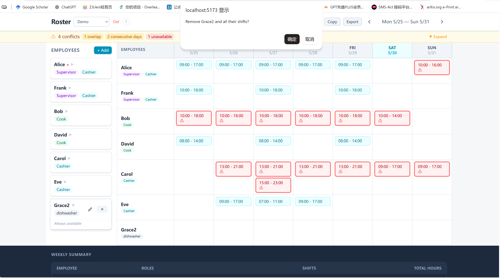 |  |

**Design decisions**: Employee roles are stored as `string[]` to support multi-role staff. Role matching for shift swaps uses exact set equality (sorted arrays). Selected roles are displayed as colored badges. Edit/delete buttons appear on hover via conditional rendering.

### 1.2 Assign an Employee to a Day and Time Slot

Click any grid cell (or the "+" icon on hover) to assign a shift.

| Empty Cell Hover | Assignment Form | Shift Badge |
|------------------|-----------------|-------------|
|  |  |  |

**Design decisions**: Each shift stores a concrete calendar `date: string` (YYYY-MM-DD), computed from `weekStartDate + day offset`. Time is `HH:MM` strings. This enables week-independent filtering — each week has its own shifts. The same cell can contain multiple shifts (add via the persistent "+" button).

### 1.3 Weekly Grid — Days as Columns, Employees as Rows


**Design decisions**: 8-column CSS Grid (`180px repeat(7, 1fr)`) — employee name column + 7 day columns. No third-party calendar or scheduling library used (requirement §3). Days show short names and dates. The current day column is highlighted in cyan. Week navigation uses `< >` arrows with date range display.

### 1.4 Conflict Detection

Three conflict types detected globally across all weeks:

| Type | Rule | Visual |
|------|------|--------|
| Overlap | Same employee, same date, `a.start < b.end && b.start < a.end` | Red border + pink cell |
| Consecutive Days > 5 | Calendar-date sliding window (cross-week) | Red border + pink cell |
| Unavailable | Shift falls within an unavailability rule | Red border + pink cell |


| Banner Collapsed | Banner Expanded |
|------------------|-----------------|
|  | 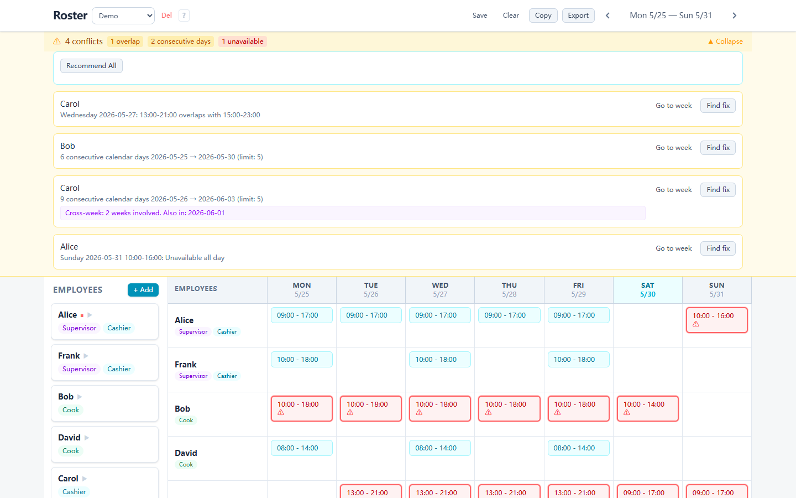 |

Cross-week consecutive days (e.g. Fri–Sun + Mon–Wed) are detected via calendar-date comparison rather than per-week grouping:


**Design decisions**: Conflicts are **derived state** — `detectAllConflicts(shifts, employees)` is a synchronous pure function called on render. No stored redundancy. Consecutive-day detection sorts all working dates per employee, then finds the longest consecutive-date streak using `(date[i] - date[i-1]) / 86400000 === 1`. This naturally handles week boundaries.

### 1.5 Summary Panel — Total Hours Per Employee

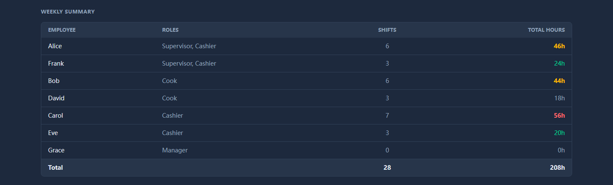

**Design decisions**: Hours color-coded: `<20h` gray, `20–40h` green, `40–48h` yellow, `48h+` red. Rendered as a dark footer table to visually separate from the roster grid. Total row at the bottom.

---

## 2. Bonus (Stretch Goals)

### 2.1 Drag-and-Drop Shift Reassignment

Shift badges are draggable (grab cursor). Uses `@dnd-kit/core` with `PointerSensor` (5px activation distance — prevents accidental drag on click). Collision detection: `pointerWithin` for cross-day dragging. Only same-role employees can receive dragged shifts.

| Before Drag | During Drag | After Drop |
|-------------|-------------|-------------|
|  | 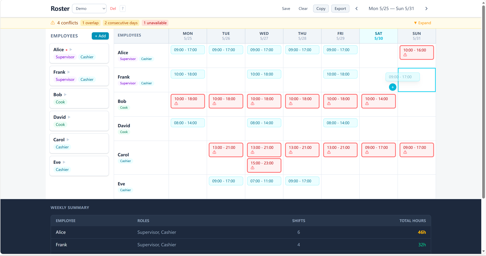 | 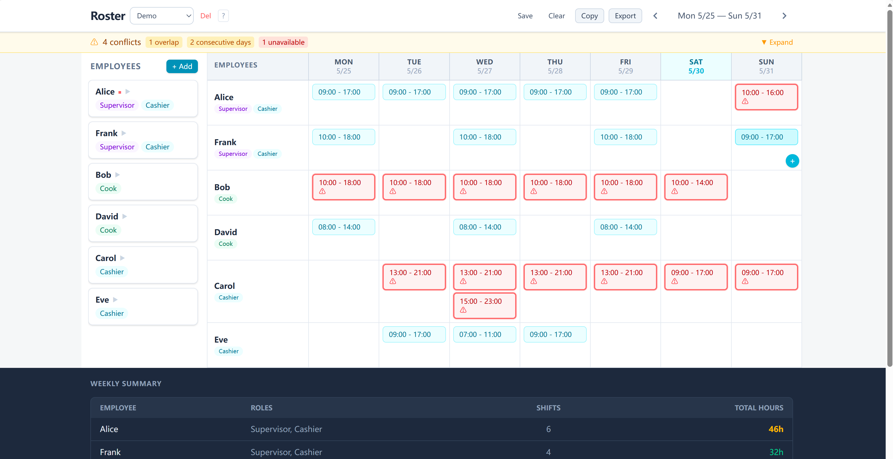 |

**Design**: Each ShiftBadge uses `useDraggable`, each ShiftCell uses `useDroppable` with composite ID `${employeeId}:${day}`. On `onDragEnd`, UPDATE_SHIFT dispatches with new `employeeId`, `day`, and recomputed `date`.

### 2.2 Employee Availability Preferences

Each employee can have multiple unavailability rules. Each rule specifies:
- **Date range** (from/to, blank = always)
- **Days of week** (toggle buttons, blank = every day)
- **Time ranges** (multiple per rule, blank = all day)

| Before (Expanded Employee Card) | During (Edit Unavailability) | After |
|----------------------|------------------------------|------------------------|
|  |  |  |

**Design decisions**: `UnavailableSlot[]` on Employee. `isAvailable()` checks date range → day-of-week filter → time overlap. Click an employee card (not edit) to expand and see rules inline. Assignment form shows an amber warning when the selected shift conflicts with availability.

### 2.3 CSV Export

Click **Export** in the toolbar, customize filename, download.

| During (Export Card) |
|-----------------------|
| 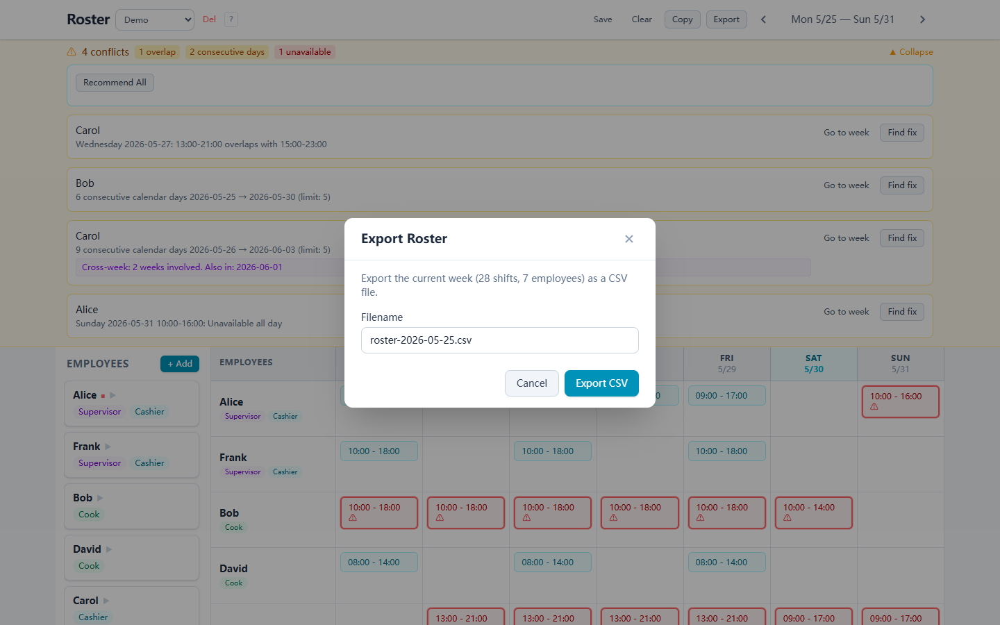 |

**Design decisions**: Pure string generation — no library dependency. Multi-shift days use semicolon separators. Empty cells left blank.

### 2.4 Mobile-Responsive Layout

On narrow screens (<1024px), the layout switches to a mobile-optimized view:

- **Hamburger menu** (☰) opens the employee sidebar as a slide-in drawer with backdrop overlay
- **Day tabs** replace the 7-column grid — swipe between days with ◀ ▶ arrows
- **Vertical shift list** per employee with inline "+ Add shift" buttons

| Main View | Sidebar Drawer | Day Switched |
|-----------|----------------|--------------|
| 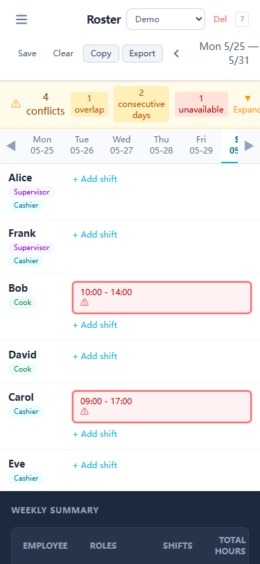 | 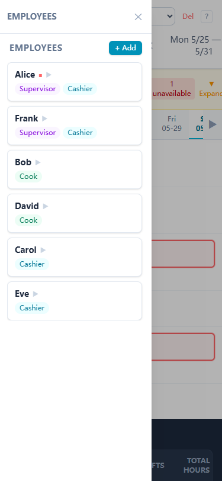 | 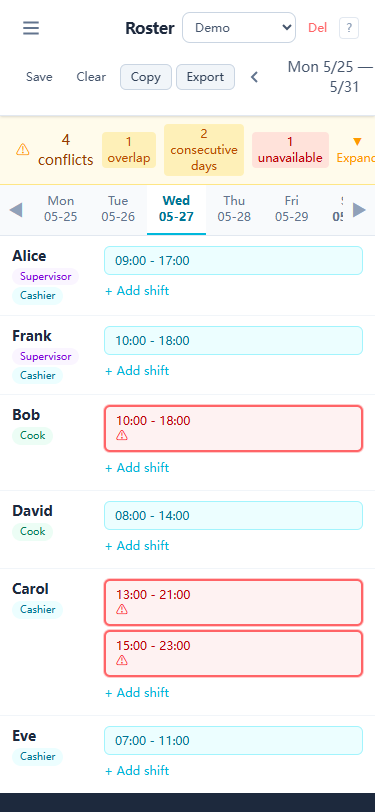 |

**Design**: Uses `lg:` Tailwind breakpoint. Desktop: `hidden lg:flex` for grid, `lg:hidden` for mobile view. Drawer uses CSS `@keyframes slideIn` animation. Day tabs have `scrollbar-hide` class for clean scrolling.

---

## 3. Extra: AI Conflict Resolution

A constraint-satisfaction solver using **Hill-Climbing with Random Restarts**.

**Model**: State = all shift assignments. Cost = `overlap×100 + consecutive_days×50 + unavailable×50`. Goal = cost → 0.

**Algorithm**: For each conflicted shift, generate same-day moves/swaps to same-role employees. Evaluate global cost impact. Accept if cost decreases, or with 50% probability on plateau (escape local optima). Run 8 independent trials, pick the shortest solution.

| Before | Solution Plan | After Apply |
|--------|---------------|-------------|
| 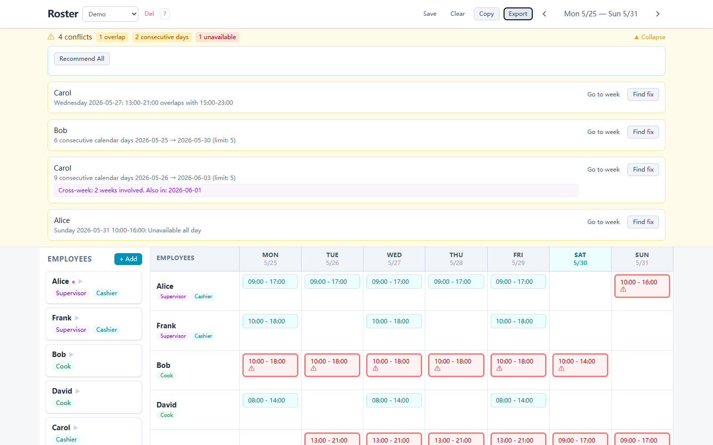 | 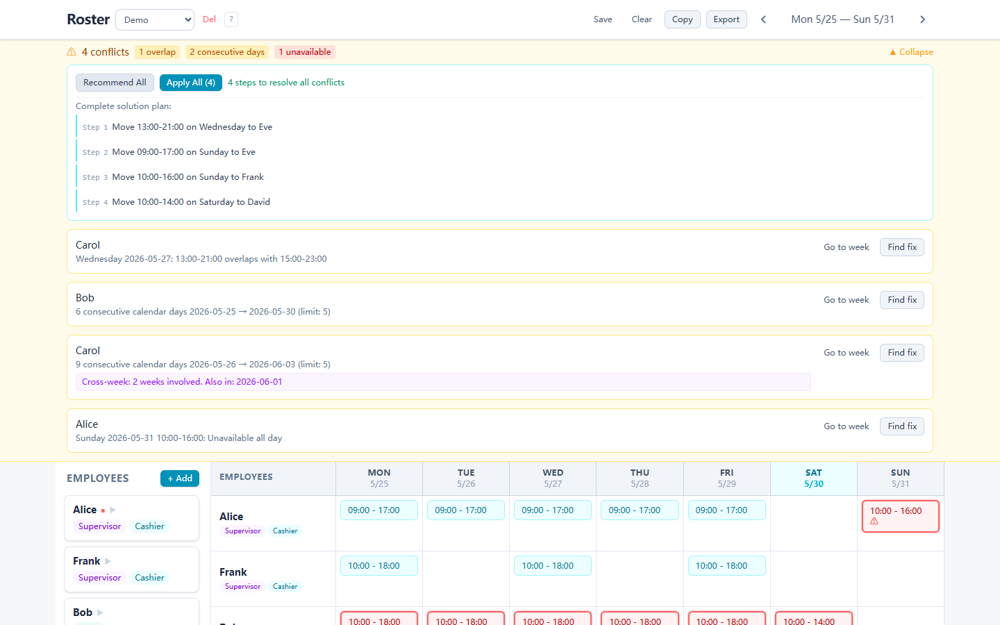 | 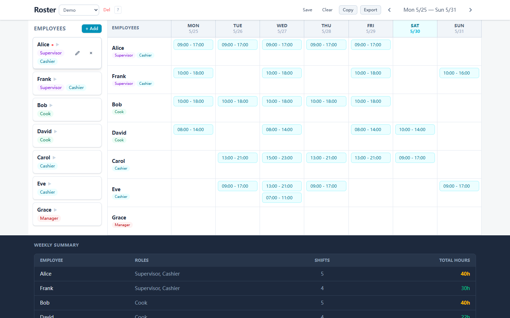 |

**Constraints enforced**: Same-day only (no time modification), exact role-set match, availability check for both swap sides, no new conflicts introduced.

---

## 4. Data Model

```typescript
Employee {
  id: string
  name: string
  roles: string[]           // e.g. ["Supervisor", "Cashier"]
  unavailableSlots: {
    dateFrom?: string        // YYYY-MM-DD, blank = always
    dateTo?: string
    days?: DayOfWeek[]       // Mon-Sun, blank = every day
    timeRanges?: { startTime: string, endTime: string }[]  // blank = all day
  }[]
}

Shift {
  id: string
  employeeId: string         // FK → Employee
  date: string               // YYYY-MM-DD concrete calendar date
  day: DayOfWeek             // Monday | ... | Sunday
  startTime: string          // HH:MM
  endTime: string            // HH:MM
}

Conflict {                   // derived, not stored
  type: 'overlap' | 'consecutive_days' | 'unavailable'
  employeeId: string
  description: string
  involvedShiftIds: string[]
}
```

---

## 5. Architecture

```
types/   → Shared interfaces (zero runtime)
logic/   → Pure functions: conflict detection, hour calculation, solver
context/ → React Context + useReducer (12 actions)
components/ → UI layer: reads state, dispatches actions
```

**Key design choices**:

- **Context + useReducer** over Redux/Zustand: 12 actions, shallow state shape, zero dependencies. Migratable upward if complexity grows.
- **CSS Grid** over calendar libraries: requirement bans scheduling libraries. Full control over cell rendering for the "employees-as-rows" layout.
- **Pure function conflict detection**: no stored state, recalculated on render. O(n²) for pairwise overlaps — imperceptible at small-team scale.
- **In-memory storage**: no backend/database as required. File-based persistence via Vite plugin (opt-in).

---

## 6. Project Structure

```
src/
├── types/index.ts
├── data/  (sampleData, teamApi, teamLoader, team templates)
├── logic/ (conflictDetector, hourCalculator, rosterUtils, recommendFix)
├── context/RosterContext.tsx
└── components/
    ├── Header, ConflictBanner
    ├── EmployeeManager/ (EmployeeList, EmployeeCard, EmployeeFormModal)
    ├── RosterGrid/ (WeeklyGrid, GridHeader, ShiftCell, ShiftBadge, ShiftFormModal)
    ├── SummaryPanel/
    ├── CopyWeekModal, ClearRangeModal, ExportModal
    ├── MiniCalendar, HelpModal, ErrorBoundary
    └── ui/ (Button, Dialog, Badge, Input, Select)
```

---

## Tech Stack

| Layer | Choice |
|-------|--------|
| Framework | React 18 + TypeScript |
| Build | Vite |
| Styling | Tailwind CSS v4 |
| State | Context + useReducer |
| Drag & Drop | @dnd-kit/core |

| Runtime dependencies | 2 (`react`, `react-dom` + `@dnd-kit/core`) |


