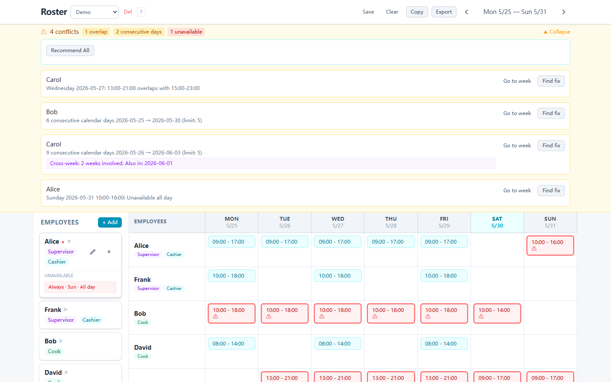
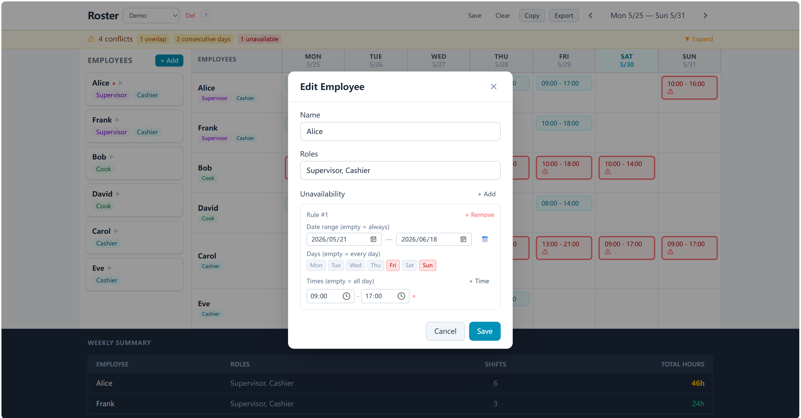

# Shift Roster Builder

A web app for managing a weekly staff schedule for a small team — add employees, assign shifts, drag to reassign, spot conflicts, and export everything to CSV.

Built for **Option A: Shift Roster Builder** — Internship Coding Challenge.

## Setup

```bash
npm install
npm run dev
```

Opens at http://localhost:5173. Demo data loads on first launch, or select "Demo" from the team dropdown. Everything lives in memory during use; teams are persisted to JSON files under `data/teams/`.

---

## 1. Core Requirements

### 1.1 Add, Edit, and Remove Employees

Each employee has a name and one or more roles (e.g. Cashier, Supervisor, Cook). Roles are entered as comma-separated free text.

**Add:**


**Edit:**


**Remove:**


Roles are stored as `string[]` so employees can have multiple roles. Shift swaps only match employees with the exact same role set (sorted arrays compared). Roles show up as colored badges, and edit/delete buttons appear on hover.

### 1.2 Assign an Employee to a Day and Time Slot

Click any cell in the grid (or the "+" that appears on hover) to bring up the assignment form.


Each shift stores a concrete `date: string` (YYYY-MM-DD) calculated from the week's start date plus the day offset, plus `startTime`/`endTime` as `HH:MM` strings. This keeps things week-independent — you can navigate between weeks and each week has its own shift data. Cells can hold multiple shifts; the "+" button stays visible so you can keep adding.

### 1.3 Weekly Grid — Days as Columns, Employees as Rows


An 8-column CSS Grid — `180px` for the employee name, then `repeat(7, 1fr)` for Monday through Sunday. No calendar or scheduling libraries, just CSS. Day headers show short name + date. The current day column gets a cyan highlight, and week navigation uses `< >` arrows with the date range shown between them.

### 1.4 Conflict Detection

Three kinds of conflicts are caught across all weeks:

| Type | Rule | Visual |
|------|------|--------|
| Overlap | Same employee, same date, times overlap (`a.start < b.end && b.start < a.end`) | Red border + pink cell |
| Consecutive Days > 5 | Calendar-date sliding window, works across week boundaries | Red border + pink cell |
| Unavailable | Shift falls during an employee's unavailability rule | Red border + pink cell |


Cross-week consecutive days (e.g. working Fri–Sun and then Mon–Wed) are detected by comparing actual calendar dates, not by looking at each week in isolation:


Conflicts are computed on the fly — `detectAllConflicts(shifts, employees)` is a pure function called during render, no duplicate state to keep in sync. For consecutive-day detection, it collects every date an employee works, sorts them, and walks through looking for runs where `dateDiff === 1` day.

### 1.5 Summary Panel — Total Hours Per Employee


A footer table below the roster shows each employee's total hours for the week, color-coded: `<20h` gray, `20–40h` green, `40–48h` yellow, `48h+` red. Includes a total row.

---

## 2. Bonus (Stretch Goals)

### 2.1 Drag-and-Drop Shift Reassignment

Shifts can be dragged between employees. Built with `@dnd-kit/core` — `PointerSensor` with a 5px activation distance so clicks don't accidentally trigger a drag, and `pointerWithin` collision detection for cross-day drops. Only employees with the exact same role set can receive a dragged shift.


Each `ShiftBadge` uses `useDraggable`, each `ShiftCell` uses `useDroppable` with a composite key of `${employeeId}:${day}`. On drop, an `UPDATE_SHIFT` action fires with the new employee, day, and date.

### 2.2 Employee Availability Preferences

Each employee can define when they *can't* work. A rule can narrow down by:

- **Date range** (from / to — leave blank for "always applies")
- **Days of week** (toggle buttons — leave blank for every day)
- **Time ranges** (multiple per rule — leave blank for all day)






These are stored as `UnavailableSlot[]` on the employee. The `isAvailable()` check runs through date range → day-of-week filter → time overlap for each rule. Click an employee card (not the edit button) to expand and see their rules inline. The assignment form shows a warning if the shift you're adding falls outside their availability.

### 2.3 CSV Export

Click **Export** in the toolbar, name your file, and download. No external CSV library — it's just string building. Cells with multiple shifts use semicolons as separators; empty cells stay blank.


### 2.4 Mobile-Responsive Layout

Below 1024px wide, the layout switches to a phone-friendly view:

- **Hamburger menu** (☰) opens the employee sidebar as a slide-in drawer with a backdrop
- **Day tabs** replace the 7-column grid — ◀ ▶ arrows let you flip between days
- **Vertical shift list** per employee, with inline "+ Add shift" buttons


Uses Tailwind's `lg:` breakpoint for the switch — `hidden lg:flex` on the desktop grid, `lg:hidden` on the mobile view. The drawer slides in with a CSS `@keyframes slideIn` animation.

---

## 3. Extra: AI Conflict Resolution

A hill-climbing solver with random restarts for resolving scheduling conflicts.

**How it works:** The solver treats the current shift assignments as a "state" and assigns a cost — 100 per overlap, 50 per consecutive-day violation, 50 per unavailability conflict. The goal is to get the cost to zero.

At each step, it looks at conflicted shifts, generates possible moves and swaps to same-role employees (same day only, no time changes), and picks the one that lowers the global cost the most. If the cost plateaus, it has a 50% chance of taking the move anyway to escape local optima. It runs 8 independent trials and keeps the shortest solution.


Constraints: moves stay on the same day, roles must match exactly, availability is checked for both sides of a swap, and no new conflicts can be introduced.

---

## 4. Data Model

```typescript
Employee {
  id: string
  name: string
  roles: string[]           // e.g. ["Supervisor", "Cashier"]
  unavailableSlots: {
    dateFrom?: string        // YYYY-MM-DD, blank = always
    dateTo?: string
    days?: DayOfWeek[]       // Mon-Sun, blank = every day
    timeRanges?: { startTime: string, endTime: string }[]  // blank = all day
  }[]
}

Shift {
  id: string
  employeeId: string         // FK → Employee
  date: string               // YYYY-MM-DD concrete calendar date
  day: DayOfWeek             // Monday | ... | Sunday
  startTime: string          // HH:MM
  endTime: string            // HH:MM
}

Conflict {                   // derived, not stored
  type: 'overlap' | 'consecutive_days' | 'unavailable'
  employeeId: string
  description: string
  involvedShiftIds: string[]
}
```

---

## 5. Architecture

```
types/   → Shared interfaces, zero runtime cost
logic/   → Pure functions: conflict detection, hour calculation, solver
context/ → React Context + useReducer (16 actions)
components/ → UI layer: reads state, dispatches actions
```

A few notes on the choices here:

- **Context + useReducer** instead of Redux or Zustand — 16 actions and a flat state shape didn't need the extra dependency.
- **CSS Grid** for the roster — the spec said no scheduling libraries, and CSS Grid maps naturally to "employees as rows, days as columns."
- **Pure functions for conflict detection** — conflicts are recalculated on every render, no stored duplication to drift out of sync.
- **In-memory state** with optional JSON file persistence — no backend needed.

---

## 6. Project Structure

```
src/
├── types/index.ts
├── data/  (sampleData, teamApi, teamLoader, team templates)
├── logic/ (conflictDetector, hourCalculator, rosterUtils, recommendFix)
├── context/RosterContext.tsx
└── components/
    ├── Header, ConflictBanner
    ├── EmployeeManager/ (EmployeeList, EmployeeCard, EmployeeFormModal)
    ├── RosterGrid/ (WeeklyGrid, GridHeader, ShiftCell, ShiftBadge, ShiftFormModal)
    ├── SummaryPanel/
    ├── CopyWeekModal, ClearRangeModal, ExportModal
    ├── MiniCalendar, HelpModal, ErrorBoundary
    └── ui/ (Button, Dialog, Badge, Input, Select)
```

---

## Tech Stack

| Layer | Choice |
|-------|--------|
| Framework | React 18 + TypeScript |
| Build | Vite |
| Styling | Tailwind CSS v4 |
| State | Context + useReducer |
| Drag & Drop | @dnd-kit/core |

| Runtime dependencies | 3 (`react`, `react-dom`, `@dnd-kit/core`) |
